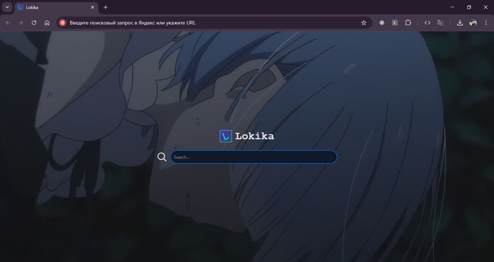

# Lokika Homepage

The extension overwrites the browser's (Google Chrome) home page.



## [manifest.json](./manifest.json)

```json
{
  "name": "Lokika Homepage",
  "description": "Pretty startpage for you",
  "version": "1.0",
  "manifest_version": 3,
  "homepage_url": "https://github.com/lanvalird/lokika",
  "action": {
    "default_popup": "popup.html"
  },
  "options_page": "settings.html",
  "chrome_url_overrides": {
    "newtab": "index.html"
  },
  "permissions": ["search", "storage"],
  "background": {
    "service_worker": "src/background.ts",
    "type": "module"
  }
}
```